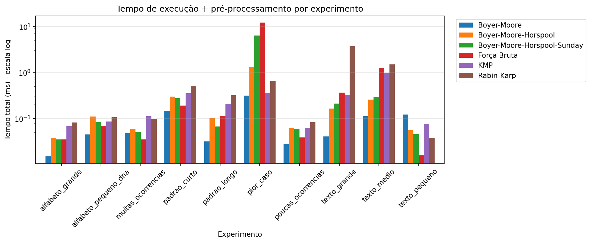
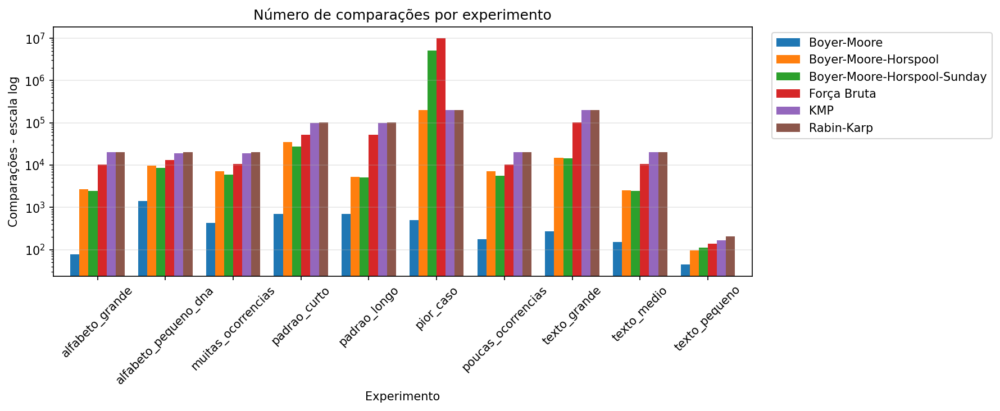

# Trabalho Prático - Casamento de Padrões

**Disciplina:** Algoritmos e Estruturas de Dados II  
**Tema:** Casamento de Padrões em Strings

## 📋 Descrição

Este projeto implementa e compara diferentes algoritmos de busca de padrões em strings, analisando seus comportamentos teóricos e empíricos em diversos cenários.

## 🎯 Algoritmos Implementados

1. **Força Bruta** - Complexidade: O(n·m)
2. **Rabin-Karp** - Complexidade: O(n+m) médio, O(n·m) pior caso
3. **Knuth-Morris-Pratt (KMP)** - Complexidade: O(n+m)
4. **Boyer-Moore** - Complexidade: Sublinear médio, O(n·m) pior caso
5. **Boyer-Moore-Horspool** - Complexidade: Sublinear médio
6. **Boyer-Moore-Horspool-Sunday** - Complexidade: Sublinear médio

## 🚀 Executando o Programa

```bash
# 1. Gerar os arquivos de experimento (execute uma única vez)
dart run bin/generate_experiments.dart

# 2. Executar os experimentos e gerar relatórios CSV
dart run bin/tp03.dart

# 3. Gerar tabelas comparativas
python bin/generate_table.py

# 4. Gerar gráficos 
python bin/generate_graphics.py
```

Os arquivos de experimento são salvos em `experiments/` e reutilizados em todas as execuções. Os resultados (CSVs e gráficos) são salvos em `results/`.

## 📊 Resultados

### Gráficos Comparativos

#### Tempo de execução (tempo de busca + pré-processamento)



#### Número de comparações



### Tabelas Comparativas por Experimento

#### Texto pequeno (95 caracteres, padrão 5, 3 ocorrências)

| Algoritmo | Tempo (ms) | Pré-proc (ms) | Comparações |
|-----------|------------|---------------|-------------|
| Força Bruta | 0,016 | 0,000 | 139 |
| Rabin-Karp | 0,025 | 0,013 | 203 |
| KMP | 0,043 | 0,034 | 168 |
| Boyer-Moore | 0,066 | 0,057 | 44 |
| Boyer-Moore-Horspool | 0,034 | 0,022 | 96 |
| Boyer-Moore-Horspool-Sunday | 0,029 | 0,017 | 111 |

#### Texto médio (~10k caracteres, padrão 10, 7 ocorrências)

| Algoritmo | Tempo (ms) | Pré-proc (ms) | Comparações |
|-----------|------------|---------------|-------------|
| Força Bruta | 1,255 | 0,000 | 10453 |
| Rabin-Karp | 1,494 | 0,004 | 20147 |
| KMP | 0,980 | 0,003 | 19920 |
| Boyer-Moore | 0,103 | 0,010 | 153 |
| Boyer-Moore-Horspool | 0,254 | 0,004 | 2498 |
| Boyer-Moore-Horspool-Sunday | 0,288 | 0,009 | 2436 |

#### Texto grande (~100k caracteres, padrão 15, 8 ocorrências)

| Algoritmo | Tempo (ms) | Pré-proc (ms) | Comparações |
|-----------|------------|---------------|-------------|
| Força Bruta | 0,365 | 0,000 | 101627 |
| Rabin-Karp | 3,697 | 0,032 | 201120 |
| KMP | 0,327 | 0,002 | 199872 |
| Boyer-Moore | 0,038 | 0,003 | 274 |
| Boyer-Moore-Horspool | 0,155 | 0,009 | 14930 |
| Boyer-Moore-Horspool-Sunday | 0,192 | 0,019 | 14269 |

#### Padrão curto (~50k caracteres, padrão 3, 5 ocorrências)

| Algoritmo | Tempo (ms) | Pré-proc (ms) | Comparações |
|-----------|------------|---------------|-------------|
| Força Bruta | 0,192 | 0,000 | 52085 |
| Rabin-Karp | 0,508 | 0,002 | 100534 |
| KMP | 0,355 | 0,001 | 99905 |
| Boyer-Moore | 0,144 | 0,003 | 691 |
| Boyer-Moore-Horspool | 0,298 | 0,002 | 35386 |
| Boyer-Moore-Horspool-Sunday | 0,275 | 0,003 | 27680 |

#### Padrão longo (~50k caracteres, padrão 50, 9 ocorrências)

| Algoritmo | Tempo (ms) | Pré-proc (ms) | Comparações |
|-----------|------------|---------------|-------------|
| Força Bruta | 0,114 | 0,000 | 52436 |
| Rabin-Karp | 0,320 | 0,001 | 100791 |
| KMP | 0,201 | 0,006 | 99509 |
| Boyer-Moore | 0,024 | 0,008 | 699 |
| Boyer-Moore-Horspool | 0,069 | 0,033 | 5302 |
| Boyer-Moore-Horspool-Sunday | 0,051 | 0,016 | 5103 |

#### Poucas ocorrências (~10k caracteres, padrão 3, 3 ocorrências)

| Algoritmo | Tempo (ms) | Pré-proc (ms) | Comparações |
|-----------|------------|---------------|-------------|
| Força Bruta | 0,039 | 0,000 | 10421 |
| Rabin-Karp | 0,083 | 0,000 | 20103 |
| KMP | 0,062 | 0,001 | 19968 |
| Boyer-Moore | 0,026 | 0,002 | 177 |
| Boyer-Moore-Horspool | 0,060 | 0,002 | 7114 |
| Boyer-Moore-Horspool-Sunday | 0,057 | 0,003 | 5559 |

#### Muitas ocorrências (~10k caracteres, padrão 3, 100 ocorrências)

| Algoritmo | Tempo (ms) | Pré-proc (ms) | Comparações |
|-----------|------------|---------------|-------------|
| Força Bruta | 0,035 | 0,000 | 10475 |
| Rabin-Karp | 0,097 | 0,001 | 19985 |
| KMP | 0,088 | 0,024 | 19100 |
| Boyer-Moore | 0,038 | 0,010 | 432 |
| Boyer-Moore-Horspool | 0,056 | 0,004 | 7088 |
| Boyer-Moore-Horspool-Sunday | 0,049 | 0,002 | 5869 |

#### Alfabeto pequeno - DNA (~10k caracteres, padrão 8, 5 ocorrências)

| Algoritmo | Tempo (ms) | Pré-proc (ms) | Comparações |
|-----------|------------|---------------|-------------|
| Força Bruta | 0,070 | 0,000 | 13301 |
| Rabin-Karp | 0,108 | 0,000 | 20150 |
| KMP | 0,084 | 0,002 | 19135 |
| Boyer-Moore | 0,042 | 0,003 | 1426 |
| Boyer-Moore-Horspool | 0,106 | 0,004 | 9562 |
| Boyer-Moore-Horspool-Sunday | 0,080 | 0,004 | 8605 |

#### Alfabeto grande (~10k caracteres, padrão 8, 3 ocorrências)

| Algoritmo | Tempo (ms) | Pré-proc (ms) | Comparações |
|-----------|------------|---------------|-------------|
| Força Bruta | 0,035 | 0,000 | 10149 |
| Rabin-Karp | 0,082 | 0,000 | 20089 |
| KMP | 0,066 | 0,002 | 19977 |
| Boyer-Moore | 0,012 | 0,003 | 78 |
| Boyer-Moore-Horspool | 0,031 | 0,007 | 2693 |
| Boyer-Moore-Horspool-Sunday | 0,029 | 0,006 | 2426 |

#### Pior caso (~100k caracteres, padrão 100, 2 ocorrências)

| Algoritmo | Tempo (ms) | Pré-proc (ms) | Comparações |
|-----------|------------|---------------|-------------|
| Força Bruta | 12,201 | 0,000 | 9983754 |
| Rabin-Karp | 0,643 | 0,003 | 200127 |
| KMP | 0,350 | 0,012 | 199973 |
| Boyer-Moore | 0,304 | 0,011 | 501 |
| Boyer-Moore-Horspool | 1,310 | 0,016 | 199873 |
| Boyer-Moore-Horspool-Sunday | 6,401 | 0,014 | 5042047 |

---

## 📄 Licença

Este projeto é parte de um trabalho acadêmico da disciplina de Algoritmos e Estruturas de Dados II.
